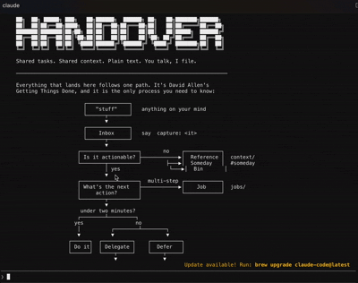

# Handover

[](LICENSE) [](CHANGELOG.md) [](https://github.com/daveyb123/Handover/actions/workflows/ci.yml) [](https://github.com/sponsors/daveyb123) [](https://www.winwithoutpitching.com/aiscale)

A to-do list for a small team that lives in plain text files and is run by
talking to an AI assistant instead of clicking around an app. Every task
and every decision carries its *why*, so whoever picks it up gets the
reasoning, not just the job.

Nobody needs to learn git. Nobody needs to learn a new app.



## 🧠 Before you start: you need an AI assistant that can work in a folder

Not the chat window. The kind that can open a folder on your computer and
read and write files in it. Two work out of the box today:

| Assistant | Cost | How it opens the folder | Notes |
|---|---|---|---|
| **Claude** (Claude Code) | **Paid.** Pro plan, about US$20 a month. The free plan does *not* include it. | Claude desktop app → **Code** tab → choose folder | The best experience: everything automatic. This is what Handover is built and tested on. |
| **ChatGPT** (Codex) | **Free plan works.** Paid plans give more use. | ChatGPT desktop app → open a folder | Works well. A few of the automatic touches (the digest appearing on its own) need one extra word from you: type `digest`. |

Also fine, if you already use them: Google Antigravity (free with a Google
account) and GitHub Copilot (free tier). Both read the same instructions.
Prices are in US dollars and change; check the vendor's page.

## 🚀 Start here

> [!TIP]
> **Stuck at any point? Use your AI as the guide.** Paste the block below
> into Claude or ChatGPT, then go back and forth: paste in whatever your
> screen says, paste in the folder's location when it asks, do what it
> says, paste what happened. Repeat until it says "Handover is ready".
> Congratulations, you're now a developeeeeer.
>
> ```
>    You                                  Your AI assistant
>     │  paste what's on screen (or the error)  │
>     │ ───────────────────────────────────────▶│
>     │                                         │  "click this / type that"
>     │ ◀─────────────────────────────────────── │
>     │  do it, paste what happened             │
>     │ ───────────────────────────────────────▶│
>     ▼                                         ▼
>           … until it says "Handover is ready"
> ```
>
> Copy this and paste it in:
>
> > I want to set up a tool called Handover: https://github.com/daveyb123/Handover
> > I'm not technical. Walk me through it one step at a time and check each
> > step worked before the next: (1) a free GitHub account if I don't have
> > one, (2) click "Use this template" on that page to make my own private
> > copy, (3) install GitHub Desktop and clone my copy to my computer,
> > (4) open that folder in your desktop app (Claude: the Code tab; ChatGPT:
> > Codex, Open folder), (5) type "set me up". Stop there. Don't explain git
> > unless I ask. At each step, ask me to paste what my screen shows, and
> > where the folder is, and tell me exactly what to click or type next. If
> > I'm on Windows, tell me to install Git for Windows first.

Nothing to type except your business name and three words. Pick your
computer.

### Windows

| Step | Do this | You'll know it worked when |
|---|---|---|
| 0 | Install [Git for Windows](https://git-scm.com/download/win): download, open, click **Next** on every screen, then **Install**. | "Git Bash" appears in your Start menu. |
| 1 | At the top of this page click **Use this template** → **Create a new repository**. Name it after your business. Choose **Private**. **Create**. (No GitHub account? It asks you to make one. Free.) | You're looking at a page with your business's name on it. |
| 2 | Install [GitHub Desktop](https://desktop.github.com), sign in. On your new repository's page click the green **Code** button → **Open with GitHub Desktop** → **Clone**. | GitHub Desktop shows your repository, and there's a folder in Documents › GitHub. |
| 3 | Install the [Claude desktop app](https://claude.ai/download), sign in (Pro or Max), click the **Code** tab → **Select folder** → that folder. *(ChatGPT instead: the [ChatGPT app](https://openai.com/chatgpt/download/) → Codex → Open folder.)* | The first line on screen says **Handover is ready**. |
| 4 | Type **set me up** and press Enter. | It says hello, offers a two-minute practice run, and starts asking about your business. |

### Mac

| Step | Do this | You'll know it worked when |
|---|---|---|
| 1 | At the top of this page click **Use this template** → **Create a new repository**. Name it after your business. Choose **Private**. **Create**. (No GitHub account? It asks you to make one. Free.) | You're looking at a page with your business's name on it. |
| 2 | Install [GitHub Desktop](https://desktop.github.com), sign in. On your new repository's page click the green **Code** button → **Open with GitHub Desktop** → **Clone**. If your Mac pops up "install the command line developer tools", click **Install**. | GitHub Desktop shows your repository, and there's a folder in Documents › GitHub. |
| 3 | Install the [Claude desktop app](https://claude.ai/download), sign in (Pro or Max), click the **Code** tab → **Select folder** → that folder. *(ChatGPT instead: the [ChatGPT app](https://openai.com/chatgpt/download/) → Codex → Open folder.)* | The first line on screen says **Handover is ready**. |
| 4 | Type **set me up** and press Enter. | It says hello, offers a two-minute practice run, and starts asking about your business. |

### Linux

Clone it, `cd` into it, run `claude`. What are you still doing here?

The assistant is only Handover while it's opened *in that folder*;
anywhere else it's just Claude or ChatGPT. Downloaded a ZIP instead of
cloning? Also fine: open that folder and say "set me up"; it sorts itself
out.

## ⌨️ If you end up in a terminal instead

Some people land in PowerShell or Terminal rather than the desktop app.
That works too. Three moves, and the third is the one people miss:

1. **Install Claude Code.** Windows: open PowerShell (Start menu, type
   "PowerShell") and paste `irm https://claude.ai/install.ps1 | iex`, then
   Enter. Mac: open Terminal and paste
   `curl -fsSL https://claude.ai/install.sh | bash`, then Enter. Close the
   window when it finishes and open a new one.
2. **Get into your Handover folder.** The terminal starts in your home
   folder, not in Handover, and nothing works until you're inside it.
   Easiest way, no typing: Windows: open the folder in File Explorer,
   right-click an empty space, choose **Open in Terminal**. Mac: in
   Finder, right-click the folder and choose **New Terminal at Folder**
   (or type `cd `, a space, then drag the folder into the window and press
   Enter). Your prompt should now end with the folder's name.
3. **Type `claude` and press Enter.** First time, it opens a browser to
   sign you in and asks you to trust the folder. Say yes. You should see
   "Handover is ready".

## 🧭 Where are you starting from?

**Already using an assistant in a terminal?** Then `cd` into the folder
and run it there. Claude Code is the reference: its hooks run the sync and
the digest for you. Codex, Antigravity, Copilot and others read the same
instructions and run the same script themselves. Skip to "How to use it
day to day".

**Prefer the browser?** claude.ai/code can open your GitHub copy directly
without anything on your computer. The core works there; the phone
capture and private-repo features assume a computer of your own, so
treat the browser as a way to look, not the way to live.

## 🤔 Why it works like this

Your tasks and your team's context are text files in a git repository because
that gives you history, attribution and offline access for free, and because
the assistant needs to read exactly the same files you do. A separate app
would be a second place for things to drift.

The assistant is the only thing that writes to the shared record. Every
change it makes is a small commit with the reasoning in it, so anyone can see
what changed and why, and anything can be undone.

It solves two things project-management tools don't:

- **Context travels with the task.** Every task and every decision carries
  its reasoning. Someone covering for a colleague gets the *why*, not just
  the *what*.
- **Getting the process out of the owner's head.** The assistant interviews
  you about real jobs. You never sit down to "write the documentation".

## 🌱 Where it came from

This started as one person's Getting Things Done system. It lived in Notion
for years and, however elegant the setup, it stayed cumbersome: too many
clicks between having a thought and having it filed. Two things changed
that. [career-ops](https://github.com/santifer/career-ops) showed that a
serious workflow could run as plain markdown inside an AI coding CLI, with
the agent doing the filing. And [Taskwarrior](https://taskwarrior.org) had
already done the hard work of making a text-based task list fast enough to
trust.

The bet behind Handover is that for systems like GTD, the future interface
is the original one: text. A file you can read, search and version beats a
UI you have to learn, especially once an assistant does the typing.

GTD maps onto the files like this:

| GTD | Here |
|---|---|
| Capture / in-basket | `people/<you>/inbox.md`, via "capture:" |
| Clarify | "let's do my inbox", one item at a time |
| Next actions, by context | `tasks.md` lines tagged `#email #call #site …` |
| Waiting for | `#waiting` |
| Someday / maybe | `#someday` |
| Projects | `jobs/<id>/` |
| Reference | `context/` |
| Review | the digest on open, and the end-of-job review |

*Getting Things Done* and *GTD* are registered trademarks of the David Allen
Company. This project is not affiliated with it.

## ☀️ How to use it day to day

Open the CLI in the repo folder. The first time, you get a welcome screen,
an optional two-minute practice run on a pretend company (say "joyride" any
time to do it again), and two short interviews. After that, the first thing
you see is your digest: what changed since you were last here, filtered to
you.

> Two new tasks from Sam. Job 2026-014 moved to review round 2. One item
> waiting on you since Monday. Current as of 09:12.
>
> Next: `let's do my inbox`

Then talk. Say "capture: ring the venue about parking" and this lands in
your inbox, with the reason in the commit:

```
- 2026-09-17 source:cli ring the venue about parking
```
```
Captured from the CLI, unprocessed.
```

That pairing, the line in the file and the why in the history, is the whole
product.

- **Capture anything:** "capture: ring the venue about parking". It lands in
  your inbox. No confirmation, no ceremony.
- **Delegate:** "give this to Sam". The assistant reads how Sam likes work
  handed over, drafts it that way, shows you, and files it on your yes.
- **Ask about a job:** "where's the Northgate bid up to?" It reads the job
  folder and tells you.
- **Log a decision:** "we're going with the two-camera setup because the
  client wants cutaways". Filed in the job's decision log with the why.
- **Mark something private:** say "that's private", or put `#private` on it.
  It goes to your own personal repo, not the shared one.
- **Process your inbox:** "let's do my inbox". One item at a time.
- **Ways in from wherever your day happens.** At setup the assistant asks
  where things land on you (email, chat, the car, meetings) and sets up
  the one that fits, with the rest a sentence away. Live in email? A
  contact called *Handover*: forward anything to it, one tap, from any
  device. On iCloud with an iPhone? "Hey Siri, add ring the venue to my
  Handover list." On WhatsApp all day? Share a message to Handover. All of
  it lands in your next "let's do my inbox". Nothing is filed without you.
- **Finish a job:** when a job is delivered, the assistant asks one question:
  *what didn't match the process file?* Your answer keeps the context true.

**The assistant will always ask before:** giving a task to someone else,
marking someone else's task done, changing a file about how the business
runs, filing anything it picked up from chat or email, or acting on anything
it inferred rather than was told.

**Personal tasks stay personal.** Your own to-do list (Taskwarrior, paper,
whatever you use) is yours. This system holds what people owe each other.
Blurring those two is what kills most team systems.

## 👋 Adding someone

Say "add Sam to the team". Being in the repository *is* the clearance, so
this is your decision, and it's a GitHub invitation: the assistant does it
if it can, or tells you the two clicks. Then send Sam the repository link
and one sentence: *open your CLI in it and say "set me up"*. Sam gets the
welcome, the practice run and a short profile interview, and appears in
everyone's digests from then on.

## 📈 It gets better as you use it

Nothing here needs a maintenance day.

- **Every finished job asks one question:** what didn't match the process
  file? The answer updates the file, citing the job.
- **A monthly divergence report** points at the file that most needs work:
  stale process files, dead tasks, proposals that were rejected, moments the
  assistant had to guess.
- **The assistant keeps a friction log** of its own guesses and your
  corrections, and offers the recurring ones back as template improvements.
- **It checks its own health** on every open and fixes what it safely can:
  a stuck sync, a missing search tool, an unpushed backlog. Anything needing
  a decision, it asks.
- **Upgrades come from the template.** Say "upgrade" and the engine files
  update in place, leaving your context, people and jobs untouched.

## 💬 Feedback, and one small ask

Say "feedback:" followed by anything, any time. The assistant records it
and gives you a prefilled link to send it to the template, with your
business details stripped. That is how the engine improves for everyone.

Once, after you've used it for a few days, the assistant will ask you for a
star on GitHub if it's earning its keep. Once. It won't ask again.

## ❤️ Supporting it

If you're enjoying this and it brings you joy, great. If it doesn't, Marie
Kondo it: thank it and let it go, no hard feelings.

If you're brave enough to delete your project-management SaaS, send what
you were paying it my way instead:
[github.com/sponsors/daveyb123](https://github.com/sponsors/daveyb123).
It funds the battle. Handover is free and MIT-licensed and stays that way
either way.

## 🔒 Privacy

Everyone in this repository has the same clearance. Everything in it is
readable by the whole team. Anything that genuinely needs tighter handling
than that stays out of the system entirely.

One word marks something private and routes it to your own personal
repository instead. The assistant also watches for things that look private
(a named person plus performance language, pay, health, legal matters) and
asks before filing. That is a safety net, not a guarantee.

## 🚫 What it won't do

Coordination and memory, not production. It tracks that the edit is due and
who's on it; it doesn't touch the timeline. It tracks that a response section
is drafted and by whom; the respondent owns the words they'll defend in the
room. Generated documents are plain markdown in the job's `outputs/` folder,
each ending with one small line: the AI contribution level on the
[AI Contribution Scale](https://www.winwithoutpitching.com/aiscale) by
Blair Enns (AI-0 to AI-5) and a "By Handover" link. Nothing else. You take them into Word, your design tool,
or wherever you like.

## 🧩 Extending it

Scope packs for new kinds of business, adapters for new signal sources, and
an identity layer in front of the adapters for businesses that need real
per-user permissions into their CRM or ERP. All three plug in without
forking; see [docs/extending.md](docs/extending.md).

## 🔌 Connectors (optional, later)

The assistant can read your team chat (Slack, Teams, Discord, Google Chat)
and your own mailbox, spot commitments, and *propose* inbox items. Chat stays
chat; nobody changes how they message. Nothing is ever filed silently.

Connecting Microsoft 365 or Google Workspace needs an admin and a consent
screen. Treat it as an upgrade once the basics are working, requested as
narrowly as possible: read-only, one mailbox, never the whole organisation.
The system is fully usable with no connectors at all.

## 🎛️ Model recommendation (September 2026)

The assistant uses two tiers. A fast, cheap model for routine reads, digests
and inbox triage; the strongest available for interviews, drafting and
strategy. In Claude Code today that means **Haiku 4.5** for routine and
**Fable 5.1** (or **Opus 5**) for drafting. Other CLIs: use their equivalent
small and large tiers. This paragraph is the only place model names appear;
update it when they change.

## ⚙️ What runs on your machine

Three small scripts, automatically, once you've trusted the folder: a pull
and digest when you open the CLI, a quiet background pull while you work,
and a commit and push when the assistant finishes a turn. Only markdown is
ever committed; anything else dropped in the folder is reported, not
pushed. Nothing goes anywhere but your own repository. Upgrades come from
the template only when you say yes, and only from a tagged release. Details
in `SECURITY.md`.

## ✅ Prerequisites

An AI assistant that can work in a folder (see the top of this page:
Claude Pro is paid, ChatGPT's free plan works), GitHub Desktop (which
brings Git with it on a Mac) or Git itself, and a Mac, Windows or Linux
computer. On Windows, Git for Windows is required first (see Start here);
without it the assistant cannot run Handover's script at all. On a Mac, if
Git is missing the assistant notices and installs it when you say "set me
up". Everything else the repo brings; the
assistant offers to install `ripgrep` for search (Taskwarrior only if you
want it).

## 🤖 AI contribution to this repository

[AI-4](https://www.winwithoutpitching.com/aiscale "AI Contribution Scale by Blair Enns, CC BY 4.0"):
AI Drafted; the author substantially edited and verified the finished work
| By [Handover](https://github.com/daveyb123/Handover)

The idea, the argument, the source material and every design decision came
from a human, written as a specification. An AI coding agent produced most
of the prose and the scripts from it. The human directed each revision,
tested the result end to end, and verified it. The scale is the
[AI Contribution Scale](https://www.winwithoutpitching.com/aiscale) by
Blair Enns, and every document this system generates carries the same line.

## 📜 Licence

MIT. See `LICENSE`. Third-party notices in `LICENSES/`. Expertise files
(someone's personal methodology) are theirs, sent to you directly, and never
part of this template.
